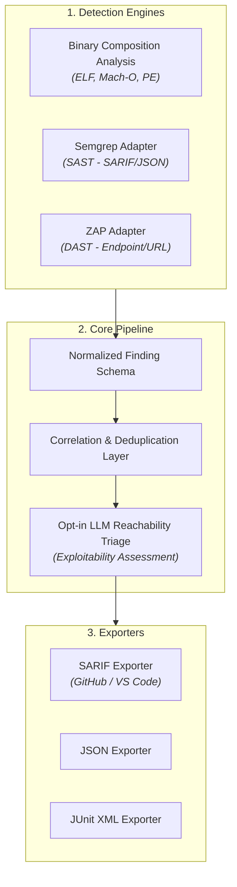

# Marshal

[](https://github.com/juliansden/marshal/actions/workflows/ci.yml)
[](LICENSE)
[](https://go.dev/)

**Marshal** is an open-source security tool that unifies binary composition analysis (BCA), SAST (via Semgrep), and DAST (via OWASP ZAP) under one correlation, triage, and reporting layer — instead of being yet another single-purpose scanner.

---

## Why Marshal?

Existing Software Composition Analysis (SCA) tools (Snyk, Dependabot, OSV-Scanner, Renovate) rely exclusively on dependency manifest files (`package.json`, `go.mod`, `requirements.txt`). They cannot inspect compiled binaries or statically linked libraries.

Marshal solves this with three key innovations:

1. **Binary Composition Analysis (BCA)**: Parses compiled binaries (`ELF` on Linux, `Mach-O` on macOS, `PE` on Windows) using Go's standard library (`debug/elf`, `debug/macho`, `debug/pe`) to fingerprint statically-linked dependencies and map them to known CVEs.
2. **Unified Correlation Engine**: Normalizes findings from Binary SCA, SAST (Semgrep), and DAST (OWASP ZAP) into a single, deduplicated schema.
3. **Opt-in LLM Reachability Triage**: Employs a provider-agnostic LLM layer on top of deterministic scan engines to judge whether detected vulnerabilities are actually reachable and exploitable in your codebase context.

---

## Architecture Overview



---

## Installation

*(Note: Binaries will be available on GitHub Releases upon Phase 1 completion).*

### Via Shell Script (Recommended)

```bash
curl -sSL https://raw.githubusercontent.com/juliansden/marshal/main/install.sh | sh
```

### Via Homebrew (macOS / Linux)

```bash
brew install juliansden/tap/marshal
```

### Via Go Install

```bash
go install github.com/juliansden/marshal/cmd/marshal@latest
```

---

## Quick Start & Usage Examples

### 1. Basic Binary SCA Scan

Scan a compiled executable binary for statically linked vulnerabilities and output SARIF:

```bash
marshal scan ./bin/myapp --format sarif --output results.sarif
```

### 2. Ingest SAST & DAST Reports into Unified Scan

Combine Semgrep SAST and ZAP DAST scan results into a single correlated output:

```bash
marshal scan . \
  --semgrep-report semgrep.sarif \
  --zap-report zap-report.json \
  --format sarif \
  --output correlated-findings.sarif
```

### 3. Run with Opt-in LLM Reachability Triage

Enable AI-powered reachability triage to downgrade unexploitable false positives:

```bash
export OPENAI_API_KEY="your-api-key"

marshal scan ./bin/myapp \
  --triage \
  --format json \
  --output triaged-findings.json
```

---

## Output Formats

Marshal natively exports findings to:
- **SARIF** (Primary): Full compatibility with GitHub Code Scanning alerts and VS Code Problems panel.
- **JSON**: Machine-readable format for custom pipelines.
- **JUnit XML**: Integration with standard CI/CD test dashboards.

---

## Release Process & Dynamic Versioning

Marshal uses **Conventional Commits** and **Release Please** to automate Semantic Versioning (SemVer) and release notes generation dynamically based on pull requests and commits:

- **`fix:`**: Bumps patch version (e.g. `v0.1.0` → `v0.1.1`).
- **`feat:`**: Bumps minor version (e.g. `v0.1.0` → `v0.2.0`).
- **`feat!:`** / **`BREAKING CHANGE:`**: Bumps major version (e.g. `v0.1.0` → `v1.0.0`).

When PRs are merged to `main`, Release Please maintains an automated Release PR with updated `CHANGELOG.md`. Merging the Release PR automatically creates the Git release tag and triggers **GoReleaser** to cross-compile binaries across Linux, macOS, and Windows.

---

## Roadmap

See [ROADMAP.md](ROADMAP.md) for the detailed phase-by-phase development plan.

---

## License

Marshal is distributed under the [Apache 2.0 License](LICENSE).
